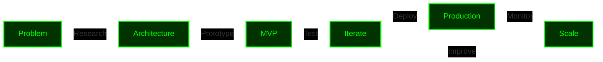

<div align="center">

```ascii
╔══════════════════════════════════════════════════════════════════════════════╗
║                                                                              ║
║                █████╗  █████╗ ██╗  ██╗ █████╗ ███████╗██╗  ██╗               ║
║               ██╔══██╗██╔══██╗██║ ██╔╝██╔══██╗██╔════╝██║  ██║               ║
║               ███████║███████║█████╔╝ ███████║███████╗███████║               ║
║               ██╔══██║██╔══██║██╔═██╗ ██╔══██║╚════██║██╔══██║               ║
║               ██║  ██║██║  ██║██║  ██╗██║  ██║███████║██║  ██║               ║
║               ╚═╝  ╚═╝╚═╝  ╚═╝╚═╝  ╚═╝╚═╝  ╚═╝╚══════╝╚═╝  ╚═╝               ║
║                                                                              ║
║                     AI & WEB3 ARCHITECT & DEVELOPER                          ║
║                                                                              ║
╚══════════════════════════════════════════════════════════════════════════════╝
```

</div>

<div align="center">

### Building The Decentralised Autonomous Future

[](https://itsmesky.com)
[](https://www.linkedin.com/in/aakash-jaiswal-773bb9244)
[](https://x.com/Aakash_jais03)


</div>

---

## WHO AM I?

```typescript
const AAKASH = {
    location: "India 🇮🇳",
    current_role: "AI & Web3 Developer",
    expertise: ["Agentic AI Systems", "Blockchain Development", "DeFi Protocols"],
    focus: "Building decentralized AI agents that actually work",
    
    philosophy: {
        code: "Ship products, not features",
        ai: "Autonomous agents > Chatbots",
        web3: "Decentralization is the future"
    },
    
    currently: {
        building: ["Senti", "Senova AI", "$Thresh"],
        learning: ["Rust", "Solana", "Advanced RL"],
        researching: ["Self-evolving LLM systems", "On-chain AI agents"]
    }
};
```

---

## PORTFOLIO HIGHLIGHTS


##  TECHNICAL ARSENAL


###  WHAT I USE TO BUILD

</div>

```python
tech_stack = {
    "languages": {
        "expert": ["Python"],
        "learning": ["Rust"] # For Solana development
    },
    
    "ai_ml": {
        "frameworks": ["PyTorch", "Hugging Face", "OpenCV"],
        "agents": ["LangChain", "LangGraph", "CrewAI", "Autogen"],
        "llms": ["GPT-4", "Gemini", "Llama", "Ollama"],
        "tools": ["Pandas", "NumPy", "XGBoost"]
    },
    
    "blockchain": {
        "chains": ["Ethereum", "Avalanche", "Solana"],
        "tools": ["Hardhat", "Foundry", "Chainlink"],
        "standards": ["ERC-20", "ERC-721", "ERC-1155", "SVM", "EVM", "SOLANA SDK"]
    },
    
    "backend": {
        "frameworks": ["FastAPI", "Flask", "GraphQL"],
        "databases": ["PostgreSQL", "MongoDB", "Redis"],
        "apis": ["REST", "GraphQL", "WebSocket"]
    },
    
    "devops": {
        "containers": ["Docker", "Kubernetes"],
        "ci_cd": ["GitHub Actions", "Jenkins"],
        "cloud": ["AWS", "GCP", "Vercel", "Google Cloud"]
    }
}
```

---

## CURRENT RESEARCH & LEARNING
<div align="center">
<table>
<tr>
<td width="50%">
    
### RUST FOR WEB3
**Building high-performance blockchain apps**

- Solana program development
- On-chain agent systems

**Focus:** High-performance decentralized systems

</td>
<td width="50%">

### MIT SEAL FRAMEWORK
**Self-evolving LLM systems**

Training LLMs via RL to:
- Generate self-edits
- Update autonomously
- Adapt to new data

[Research Paper](https://arxiv.org/pdf/2506.10943) | [Implementation](https://github.com/Continual-Intelligence/SEAL)

</td>
</tr>
</table>

---

## MY DEVELOPMENT PHILOSOPHY

<div align="center">
    

</div>

### How I Build:

1. **Deep Research** → Understanding the problem before coding
2. **Rapid Prototyping** → Quick iterations to validate ideas
3. **Production Focus** → Code that handles real users and real scenarios
4. **Continuous Learning** → Every project is an opportunity to grow

---

<div align="center">

## LET'S CONNECT

<br>

[](mailto:jaiswalraj03014@gmail.com)


[](https://www.linkedin.com/in/aakash-jaiswal-773bb9244)

[](https://x.com/Aakash_jais03)

[](https://itsmesky.com)


<br>

### HALL OF FAME

> *"If you don't believe me or don't get it, I don't have time to try to convince you, sorry."*  
> — **Satoshi Nakamoto**

---

<br>


</div>
