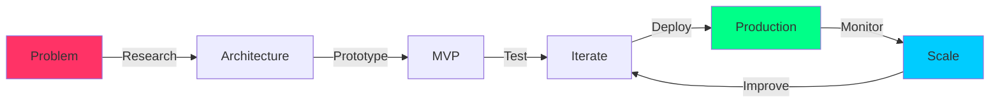

<div align="center">

```ascii
╔══════════════════════════════════════════════════════════════════════════════╗
║                                                                              ║
║     █████╗  █████╗ ██╗  ██╗ █████╗ ███████╗██╗  ██╗    ██╗ █████╗ ██╗     ║
║    ██╔══██╗██╔══██╗██║ ██╔╝██╔══██╗██╔════╝██║  ██║    ██║██╔══██╗██║     ║
║    ███████║███████║█████╔╝ ███████║███████╗███████║    ██║███████║██║     ║
║    ██╔══██║██╔══██║██╔═██╗ ██╔══██║╚════██║██╔══██║    ██║██╔══██║██║     ║
║    ██║  ██║██║  ██║██║  ██╗██║  ██║███████║██║  ██║    ██║██║  ██║██║     ║
║    ╚═╝  ╚═╝╚═╝  ╚═╝╚═╝  ╚═╝╚═╝  ╚═╝╚══════╝╚═╝  ╚═╝    ╚═╝╚═╝  ╚═╝╚═╝     ║
║                                                                              ║
║              🚀 AI & WEB3 ARCHITECT | AGENTIC SYSTEMS ENGINEER 🚀           ║
║                                                                              ║
╚══════════════════════════════════════════════════════════════════════════════╝
```

</div>

<div align="center">

### 💎 Building The Autonomous Future | One Agent At A Time

[](https://your-portfolio-url.com)
[](mailto:jaiswalraj03014@gmail.com)
[](https://www.linkedin.com/in/aakash-jaiswal-773bb9244)

</div>

---

## 🎯 WHO AM I?

```typescript
const aakashJaiswal = {
    location: "India 🇮🇳",
    current_role: "AI & Web3 Developer",
    expertise: ["Agentic AI Systems", "Blockchain Development", "DeFi Protocols"],
    focus: "Building decentralized AI agents that actually work",
    
    philosophy: {
        code: "Ship products, not features",
        ai: "Autonomous agents > Chatbots",
        web3: "Decentralization is the future"
    },
    
    status: {
        building: ["Trigslink", "Senova AI", "FinGen"],
        learning: ["Rust", "Solana", "Advanced RL"],
        open_to: ["Full-time", "Freelance", "Collaborations"]
    }
};
```

---

## 🔥 WHAT MAKES ME DIFFERENT?

<table>
<tr>
<td width="50%">

### ⚡ I DON'T JUST CODE
**I architect systems that scale**

- Built **production-grade AI agents** handling real user traffic
- Deployed **smart contracts** managing actual funds
- Shipped **3 live products** used by real people
- **Research-driven** approach to every problem

</td>
<td width="50%">

### 🚀 I SHIP FAST
**While others are still planning**

- **Senova AI**: MVP → Production in 3 months
- **Trigslink**: Decentralized MCP network live
- **Multiple hackathon wins** (because I finish)
- Real products, not just GitHub repos

</td>
</tr>
</table>

---

## 💼 PORTFOLIO HIGHLIGHTS

<div align="center">

### 🌟 PRODUCTION SYSTEMS I'VE BUILT

</div>

<table>
<tr>
<td width="33%" valign="top">

#### 🔗 [TRIGSLINK](https://trigs.link)
**Decentralized MCP Network**

The first **truly decentralized** network enabling AI agents to access on-chain context without gatekeepers.

**Impact:**
- ✅ No API keys, no rate limits
- ✅ Powered by $AVAX & Chainlink
- ✅ Production-ready infrastructure

**Tech:** `Solidity` `Python` `IPFS` `Chainlink`

🔴 **LIVE IN PRODUCTION**

</td>
<td width="33%" valign="top">

#### 🧠 [SENOVA AI](https://senova.in)
**Cognitive Wellness Platform**

AI platform combating **cognitive debt** with empathetic, research-backed guidance.

**Impact:**
- ✅ Chrome extension deployed
- ✅ Real users, real feedback
- ✅ Gamified wellness tracking

**Tech:** `Gemini` `LangChain` `FastAPI` `React`

🔴 **LIVE IN PRODUCTION**

</td>
<td width="33%" valign="top">

#### 💰 FINGEN
**AI Personal CFO**

Autonomous financial optimization using **Monte Carlo analytics** and real-time MCP data.

**Impact:**
- ✅ Goal-based strategies
- ✅ Real-time market data
- ✅ Autonomous rebalancing

**Tech:** `Python` `FastAPI` `MCP` `RL`

🟡 **RELEASING SOON**

</td>
</tr>
</table>

---

## 🛠️ TECHNICAL ARSENAL

<div align="center">

### ⚙️ WHAT I USE TO BUILD THE FUTURE

</div>

```python
tech_stack = {
    "languages": {
        "expert": ["Python", "Solidity", "JavaScript/TypeScript"],
        "learning": ["Rust"] # For Solana development
    },
    
    "ai_ml": {
        "frameworks": ["PyTorch", "Hugging Face", "OpenCV"],
        "agents": ["LangChain", "LangGraph", "CrewAI", "Autogen"],
        "llms": ["GPT-4", "Gemini", "Llama", "Ollama"],
        "tools": ["Pandas", "NumPy", "XGBoost"]
    },
    
    "blockchain": {
        "chains": ["Ethereum", "Avalanche", "Solana"],
        "tools": ["Hardhat", "Foundry", "Chainlink"],
        "standards": ["ERC-20", "ERC-721", "ERC-1155"]
    },
    
    "backend": {
        "frameworks": ["FastAPI", "Flask", "Node.js"],
        "databases": ["PostgreSQL", "MongoDB", "Redis"],
        "apis": ["REST", "GraphQL", "WebSocket"]
    },
    
    "devops": {
        "containers": ["Docker", "Kubernetes"],
        "ci_cd": ["GitHub Actions", "Jenkins"],
        "cloud": ["AWS", "GCP", "Vercel"]
    }
}
```

---

## 🎓 WHAT I'M RESEARCHING

<table>
<tr>
<td width="50%">

### 🦀 RUST FOR WEB3
**Building high-performance blockchain apps**

- Solana program development
- Anchor framework mastery
- On-chain agent systems

**Why?** Because JavaScript is too slow for what I'm building.

</td>
<td width="50%">

### 📚 MIT SEAL FRAMEWORK
**Self-evolving LLM systems**

Training LLMs via RL to:
- Generate self-edits
- Update autonomously
- Adapt to new data

[📄 Research Paper](https://arxiv.org/pdf/2506.10943) | [💻 Implementation](https://github.com/Continual-Intelligence/SEAL)

</td>
</tr>
</table>

---

## 💡 MY APPROACH

<div align="center">



</div>

### 🚀 How I Work:

1. **Deep Research** → I read papers, not just tutorials
2. **Rapid Prototyping** → Ship MVPs in weeks, not months
3. **Production Focus** → Code that handles real users and real money
4. **Continuous Learning** → Every project teaches me something new

---

## 📬 LET'S BUILD SOMETHING TOGETHER

<div align="center">

### 🤝 I'm Looking For:

<table>
<tr>
<td align="center" width="25%">

### 💼 FULL-TIME
Companies building the future of AI + Web3

</td>
<td align="center" width="25%">

### 🎯 FREELANCE
High-impact projects with real users

</td>
<td align="center" width="25%">

### 🤖 COLLABORATIONS
Open-source & research initiatives

</td>
<td align="center" width="25%">

### 🚀 STARTUPS
Early-stage teams disrupting industries

</td>
</tr>
</table>

</div>

---

<div align="center">

## 📞 CONTACT ME

### 🔥 Ready to hire someone who ships?

<br>

[](mailto:jaiswalraj03014@gmail.com)

[](https://www.linkedin.com/in/aakash-jaiswal-773bb9244)

[](https://x.com/Aakash_jais03)

[](https://your-portfolio-url.com)

<br>

### 💎 CRYPTO WALLETS

```
ETH/AVAX: 0xB1760acA3F02Ee240a45f70F4Bb84263F9Fb3f8e
SOLANA:   3HP25n9DRhoQYf86kh6NE2hj8dxJ2Dh8s7gz4ETje2tF
BITCOIN:  bc1qvsuseyq37c49qlr9fklc5jfltueev7rz9wf90k
```

---

<br>

## ⚡ QUICK FACTS

**🎯 Projects Shipped:** 3 in production, 2 launching soon  
**💻 Lines of Code:** Too many to count (but they all work)  
**🏆 Hackathons:** Multiple wins because I finish what I start  
**🌍 Timezone:** UTC+5:30 (India) | Available for global teams  
**🔥 Superpower:** Turning complex AI/Web3 ideas into working products  

---

<br>

### 💬 WHAT OTHERS SAY

> *"If you don't believe me or don't get it, I don't have time to try to convince you, sorry."*  
> — **Satoshi Nakamoto** (My coding philosophy)

---

<br>

## 🎯 CURRENTLY

```javascript
const currentStatus = {
    building: "Autonomous DeFi protocols that actually work",
    learning: "Rust & Solana to push Web3 further",
    reading: "MIT papers on self-evolving AI systems",
    shipping: "Products that solve real problems",
    
    available_for_hire: true,
    responds_to_emails: "within 24 hours",
    timezone_flexible: true,
    
    ideal_role: {
        company: "Building the future of AI/Web3",
        culture: "Ship fast, iterate faster",
        tech: "Bleeding edge, production-ready",
        impact: "Real users, real problems"
    }
};
```

---


</div>
